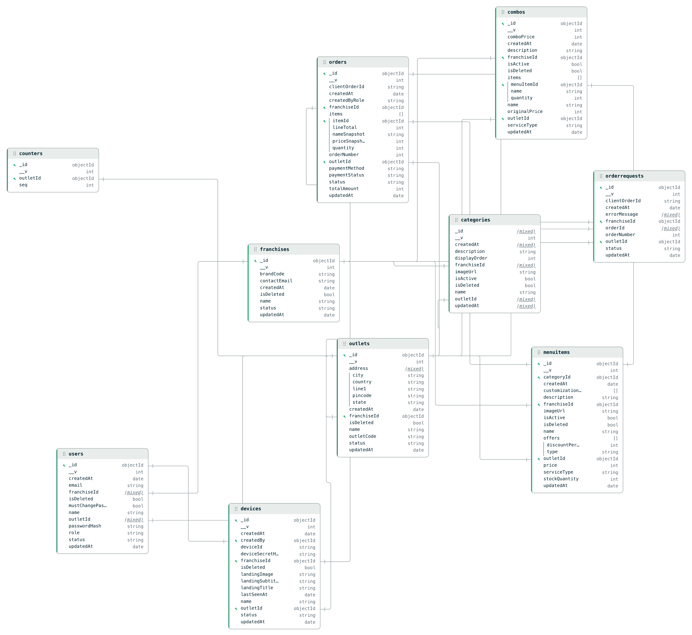

# Hyper Kitchen Hub - Kiosk

Hyper Kitchen Hub is a strict multi-tenant SaaS kitchen & franchise management system built with a scalable Node.js backend and a modern React frontend.

It enables platform admins, franchise admins, outlet managers, kitchen staff, pickup staff, and kiosk devices to operate within secure tenant boundaries.

### Tech Stack

Backend
1. Node.js
2. Express.js
3. MongoDB (Mongoose)
4. JWT Authentication
5. RBAC Engine
6. Multi-Tenant Middleware
7. Bcrypt
8. CORS

Frontend
1. React
2. Vite
3. TypeScript
4. Tailwind CSS
5. Feature-based folder structure
6. Role-based routing

### Core Features

1. JWT Authentication
2. Role-Based Access Control (RBAC)
3. Strict Multi-Tenant Isolation (franchiseId + outletId)
4. Feature-based modular frontend
5. Business modules (Orders, Menu, Inventory, Kitchen flow, etc.)

### Telemetry Rollout Notes

Kiosk telemetry now follows a buffered write path and a separate admin read surface.

Validation and rollout controls:
1. Backend smoke tests: `cd backend && npm run test:telemetry`
2. Admin rollout status endpoint: `GET /telemetry/kiosk/status`
3. Frontend admin page: `/telemetry/kiosk`
4. Disable kiosk event capture with `VITE_KIOSK_TELEMETRY_ENABLED=false`
5. Hide the admin telemetry page with `VITE_ADMIN_TELEMETRY_ENABLED=false`
6. Disable backend enqueueing with `TELEMETRY_INGEST_ENABLED=false`
7. Disable backend Redis read caching with `TELEMETRY_READ_CACHE_ENABLED=false`

### Schema Design

